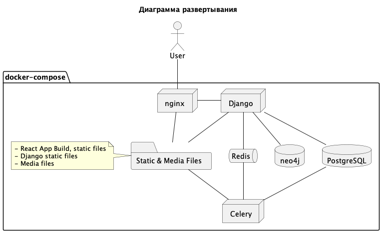

# Идея

Реализовать систему для учета профессиональных навыков сотрудника.

# Архитектура

## Верхнеуровневые сервисы

- [Django](https://www.djangoproject.com) / [GarpixCMS](https://github.com/garpixcms/garpixcms) - монолитный бэкенд на Python, включая API.
- [Django-Celery](https://celery.github.io/django-celery/introduction.html) (далее "Celery") - воркеры для выполнения фоновых задач на бэкенде.
- [Redis](https://redis.io) - redis в проекте используется для очередей и работает между Django и Django-Celery.
- [neo4j](https://neo4j.com) - графовая база данных, нужна для хранения структуры навыков в виде сети, но без привязки к пользователю.
- [PostgreSQL](https://www.postgresql.org) - объектно-реляционная база данных, используется для хранения всей оперативной инфы, включая связку между сотрудником и его навыками.
- [nginx](https://nginx.org/ru/) - веб-сервер с роутингом на бэк, фронт и раздачей статических и медиа файлов.
- [React](https://react.dev) - монолитный фронтенд. Билд раздается с помощью nginx, SSR отсутствует.
- [docker-compose](https://docs.docker.com/compose/) - используется для поднятия в контейнерах на локальной среде (`docker-compose.yml` для бэкендера и `docker-compose-local.yml` для фронтендера) и продуктовой среде (`docker-compose-production.yml`). Окружение берется из единого файла `.env`.

## Верхнеуровневые компоненты

Система состоит из следующих верхнеуровневых компонентов:
- Хранилище навыков - хранение и просмотр навыков в виде графов.
- Создание навыков - создание, модерация и редактирование навыков.
- Учет навыков - наложение навыков сотрудника на сеть, подтверждение навыков сотрудника модератором.
- Дашборд - отображение навыков и рекомендаций для сотрудника.
- Дашборд модератора - отображение ожидающих подтверждения новых навыков и навыков сотрудников.

### Хранилище навыков

Навыки хранятся в виде неориентированных графов.

Пример:

- TODO

### Создание навыков

Создание навыка должно происходить через интерфейс добавления ноды
в сеть навыков. Чтобы навык стал доступен для просмотра другим сотрудникам,
модератору необходимо его подтвердить.

Обязательно необходимо выбрать те навыки, с которыми текущий связан.
Модератор также может добавить или убрать необходимые связи.

После того как навык подтвержден, его нельзя редактировать. Причина - если
этот навык уже был добавлен кем-то из сотрудников, то при изменении связей
контекст может измениться, как следствие, будет
нарушена семантика знаний сотрудника.

Если же редактирование необходимо, то навыки у сотрудника (не в самой сети) должны 
помечаться как измененные и требовать повторного подтверждения. 
Пока навык не подтвержден повторно, для всех отображается его старое значение.

### Учет навыков

TODO

### Дашборд

Дашборд показывает:
- Сеть навыков сотрудника.
- Процент соответствия определенной сфере (например, финтех или ретейл).
- Процент знаний в бэкенде, фронтенде на конкретных языках и фреймворках.
- Рекомендации к изучению материалов для повышения знаний в выбранных сферах

TODO

### Дашборд модератора

TODO